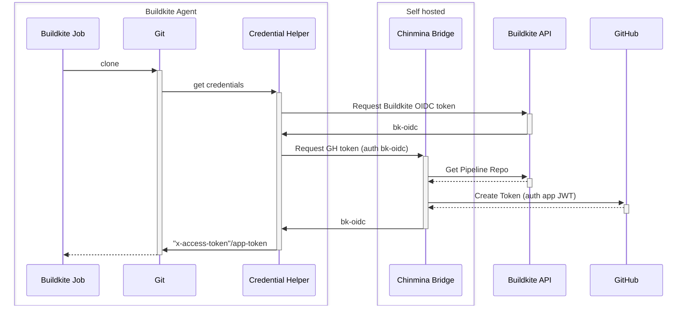

# Chinmina Bridge: Buildkite/Github OIDC token bridge

Exposes an HTTP endpoint that allows Buildkite Agents to use an OIDC token to
request a Github token in return. The GitHub token is created for the agent
using a Github application that is created for the bridge and configured to
allow access to the implementor's GitHub organization.

The token is created with `contents:read` permissions on the repository
associated with the executing pipeline.

## Why?

Using a GitHub application to authenticate GitHub actions allows:

1. The use of ephemeral API tokens (they expire after 1 hour).
2. Tokens can enable a wider set of actions than simple Git operations (e.g. PR
   comments).
3. Supplied tokens are scoped to just the resources and actions requested, not
   to the whole set of repositories and actions allowed for the app.
4. Additional configuration per repo not required. If the app has access, the
   agent can request a token for it. No need to create PATs or generate keypairs,
   and no need to upload them in multiple places.

Also, since the OIDC agent uses Buildkite's OIDC tokens to authorize requests,
the claims associated with the token can be used to further refine access to a token.

There are two options generally used to authenticate Buildkite agents to GitHub:

1. Via a PAT (owned by a GitHub user) that is saved in the agent S3 secrets bucket
2. Via a deploy key (registered to a single repository) that is likewise saved to
   S3.

Each of these have some downsides:

| **PAT**                                 | **Deploy keys**                                           |
|-----------------------------------------|-----------------------------------------------------------|
| optional expiry                         | no expiry                                                 |
| access governed by associated user [^1] | access to single repo                                     |
| manual creation (generally)             | read or read/write                                        |
|                                         | may be user-associated [^2]                               |

[^1]: if the user is decommissioned, the PAT is deactivated. The PAT has access to all repos that the
      issuing user can access.
[^2]: a registered deploy key can be associated with a user, and deactivated if that user is deactivated.
      This isn't good if the key is used to authenticate automation that is still required.

## Overview

`chinmina-bridge` is used by jobs running on a Buildkite agent to request tokens
from Github. These can be used to communicate with the GitHub API or (via Git)
to enable authenticated Git actions.

Git authentication is facilitated by a [Git credential
helper](https://github.com/jamestelfer/github-app-auth-buildkite-plugin), which
communicates with the bridge and supplies the result to Git in the appropriate
format.

The following sequence illustrates a Git authentication flow facilitated by
`chinmina-bridge`.

## Limitations

- can only grant `contents:read` access
- the app will allow access to any repository it has access to if it's
  associated with the pipeline
  - potential elevation of privilege
  - OK if your organization members have read access
  - OK if your organization controls the creation of pipelines

## Configuration

Requirements:

1. Buildkite organization, ability to create an API token
1. Github organization with permissions to create a Github App and install it into the organization
1. Ability to deploy a server that can be accessed by the build agents
1. Ability to allow Buildkite agents to download and use a custom plugin
1. (Optional) Ability to manage the configuration of agent hooks

### Buildkite setup

Create an API key with access to the REST API **only** with access to the `read_pipelines` scope.

Save the key securely: it will be provided to the server in a later step. Use a
"bot" user to create the token if you can.

### Github setup

1. Create an application in your Github organization
    - The application must request `contents:read`
    - Note the application ID
    - Create and save a private key for the application
2. Install the application into the Github organization
    - choose the repositories the application will have access to. This is the
      limit of the resources that the application can vend tokens for.

### Configure and deploy the bridge server

The server is a Go application expecting to read configuration from environment
variables, and can be deployed to a server or as a container.

#### Variables

**Server**

- `SERVER_PORT` (optional, default `8080`): the TCP port the server will listen on.
- `SERVER_SHUTDOWN_TIMEOUT_SECS` (optional, default `25`): the number of seconds
  the server will wait when asked to terminate with `SIGINT`

**Authorization**

- `JWT_BUILDKITE_ORGANIZATION_SLUG` (**required**): the slug of your Buildkite
  organization. This is the identifier of your organization that appears in your
  Buildkite URLs.
- `JWT_AUDIENCE` (optional, default=`app-token-issuer`): The expected value of the
  `aud` claim in the JWT. Describes the intended audience of the issued JWT
  token, guards against token reuse. Using a non-default value will require configuration of the credentials helper plugin.
- `JWT_ISSUER_URL` (optional, default `https://agent.buildkite.com`): the
  expected value of the `iss` claim in the agent JWT. Also used to discover the
  JWKS configuration from the `.well-known` address.
- `JWT_JWKS_STATIC` (optional): a local JWKS JSON file that can be used instead
  of Buildkite. Used to verify the JWT sent by the Buildkite agents to the
  server. This should only be required for server testing, as agents will only
  create a token using the Buildkite key.

**Buildkite API**

- `BUILDKITE_API_TOKEN` (**required**): The API token created for pipeline
  metadata lookups. **Store securely and provide to the container securely.**

**GitHub API connectivity**

- `GITHUB_APP_PRIVATE_KEY` (**required**): The PEM formatted private key of the
  created Github app. **Store securely and provide to the container securely.**
  This is a highly sensitive credential.
- `GITHUB_APP_ID` (**required**): The application ID of the Github application
  created above.
- `GITHUB_APP_INSTALLATION_ID` (**required**): The installation ID of the
  created Github application into your organization.

## Required functionality

- refinement: can this stay in KMS perhaps?
- stdout audit log:
  - JSON: repo, permissions, generated_at, issued_at, pipeline_slug,build_id, step_id

- going to want to have metrics
  - token cache hit rate (by repo?)
  - token generation time?

- traces:
  - requesting pipeline,build,step
  - cached?
  - request status

## Contributing

Contributions are welcome.

- `direnv` is the tool for setting up the test environment
- some variant of docker compose makes it easier to run locally
- Run `make keygen` to create test keys
- Execute `git` commands in the `.development/keys` directory. This has git
  configuration set up so it uses a local credential helper that will use the
  keys in the `.development/keys` directory.
