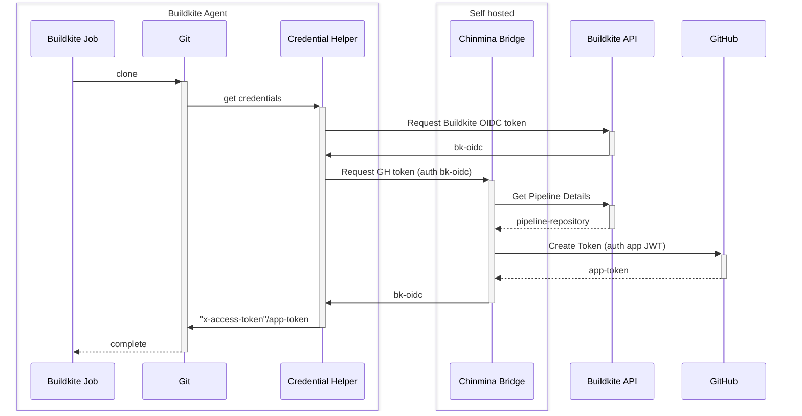

# Chinmina Bridge: Buildkite/Github OIDC token bridge

Allows Buildkite agents to get valid GitHub tokens that can be used to perform
Git or other GitHub API actions. It is intended to be an alternative to the use
of SSH deploy keys or long-lived Personal Access Tokens.

The bridge itself is an HTTP endpoint that uses a [GitHub
application][github-app] to create [ephemeral GitHub access
tokens][github-app-tokens]. Requests are authorized with a [Buildkite
OIDC][buildkite-oidc] token, allowing a token to be created just for the
repository associated with an executing pipeline.

The token is created with `contents:read` permissions, and only has access to
the repository associated with the executing pipeline.

Two endpoints are exposed: `/token`, which returns a token and its expiry, and
`/git-credentials`, which returns the token and repository metadata in the [Git
Credentials format][git-credential-helper].

[github-app]: https://docs.github.com/en/apps
[github-app-tokens]: https://docs.github.com/en/apps/creating-github-apps/authenticating-with-a-github-app/generating-an-installation-access-token-for-a-github-app
[buildkite-oidc]: https://buildkite.com/docs/agent/v3/cli-oidc
[git-credential-helper]: https://git-scm.com/docs/gitcredentials#_custom_helpers

## Overview

`chinmina-bridge` is used by jobs running on a Buildkite agent to request tokens
from Github. These can be used to communicate with the GitHub API or (via Git)
to enable authenticated Git actions.

Git authentication is facilitated by a [Git credential
helper](https://github.com/jamestelfer/github-app-auth-buildkite-plugin), which
communicates with the bridge and supplies the result to Git in the appropriate
format.

The following sequence illustrates a Git authentication flow facilitated by
`chinmina-bridge`.

## Why?

There are two options generally used to authenticate Buildkite agents to GitHub:

1. Via a PAT (owned by a GitHub user) that is saved in the agent S3 secrets bucket
2. Via a deploy key (registered to a single repository) that is likewise saved to
   S3.

As the organization scales however, the overhead of managing them becomes
unwieldy, and it can be quite difficult for an organisation to successfully
manage a rotation scheme.

Unless centralized issuance is practiced as well, both of these schemes can
produce tokens that are tied to a user, leading to unexpected problems when a
user leaves the organization. There is also the potential for key material to be
stored or shared incorrectly, leading to increased possibility of accidental
leakage.

Lastly, all key material is typically stored in an S3 bucket. This is
straightforward to configure and maintain, but creates a significant issue in
the event of an account/bucket breach.

Using a GitHub application to authenticate GitHub actions allows:

1. Access keys for repositories are generated on demand and expire after one
   hour.
1. The generated tokens are only kept by a build agent for the duration of the
   step, and do not require any other persistence.
1. The private key for the GitHub application is specific to the
   `chinmina-bridge` service. It can (and should) be rotated, an operation that
   is easy to perform.
1. Supplied tokens are scoped to just the repositories and actions necessary for
   the requesting pipeline.
1. Additional Buildkite configuration per repository is not required. If the
   application has access, the agent can request a token for it. No need to
   create PATs or generate keypairs, and no need to upload them in multiple
   places. This allows the an organization to have tighter access control on
   pipeline setup without creating additional support overhead.
1. Tokens can enable a wider set of actions than simple Git operations (e.g. PR
   comments). This is not yet implemented in `chinmina-bridge`, but is a high
   priority for future enhancement.

Also, since `chinmina-bridge` uses Buildkite's OIDC tokens to authorize requests,
the claims associated with the token can be used to further refine access to a token.

Github has some [good documentation][gh-deploy-keys] about the pros and cons of
the application token approach. There are two primary downsides documented:

> - Additional setup is needed to create the GitHub App.
> - Installation access tokens expire after 1 hour, and so need to be
>   re-generated, typically on-demand using code.

`chinmina-bridge` solves the second problem, by making token generation for a
pipeline at build time trivial.

[gh-deploy-keys]: https://docs.github.com/en/authentication/connecting-to-github-with-ssh/managing-deploy-keys#github-app-installation-access-tokens

### What's right for your organization?

To understand what's right for your organization, consider:

- how many pipelines do you have? (That is, how many keys are managed?)
- how easily are tokens rotated?
- (related) if the secrets bucket is somehow compromised, how difficult would it be for the organization to respond?
- if tokens are issued to a user, does a person leaving cause an outage in a build pipeline?
- what processes/restrictions does your organization have around repository access in GitHub and pipeline creation in Buildkite?

## Limitations

- can only grant `contents:read` access
- will only grant access to the repository associated with a pipeline
- if the buildkite user has permissions to modify the pipeline repository, they
  may configure a repository that they don't have access to in GitHub (but is
  accessible in the app). This would allow them to potentially extract code via
  use of the pipeline step configuration. **BUT**:
  - it's OK if your organization members have read access to the same set of
    repositories covered by the `chinmina-bridge` GitHub application. 
    **OR**
  - it's OK if your organization controls the creation/configuration of
    pipelines: this restricts the opportunity to misconfigure a pipeline.

## Operations

See the [observability documentation](./docs/observability.md) for more details
on the information provided by the system when running.

## Configuration

Requirements:

1. A Buildkite organization, and a user with sufficient access to create an API
   token that can be used to get the details of any pipeline that is expected to
   be built.
1. A Github organization, and a user with sufficient permissions to create a
   Github App and install it into the organization.
1. Ability to deploy a server that can be accessed by the build agents (for example, an ECS service)
1. Ability to allow Buildkite agents to download and use a custom plugin _or_
   ability to add a plugin to the default settings of the Buildkite agents.

### Buildkite setup

Create an API key with access to the REST API **only** with access to the `read_pipelines` scope.

Save the key securely: it will be provided to the server in a later step. Use a
"bot" user to create the token if you can.

### Github setup

1. Create an application in your Github organization
    - The application must request `contents:read`
    - Note the application ID
    - Create and save a private key for the application
2. Install the application into the Github organization
    - choose the repositories the application will have access to. This is the
      limit of the resources that the application can vend tokens for.

### Configure and deploy the bridge server

The server is a Go application expecting to read configuration from environment
variables, and can be deployed to a server or as a container.

#### Variables

**Server**

- `SERVER_PORT` (optional, default `8080`): the TCP port the server will listen on.
- `SERVER_SHUTDOWN_TIMEOUT_SECS` (optional, default `25`): the number of seconds
  the server will wait when asked to terminate with `SIGINT`

**Authorization**

- `JWT_BUILDKITE_ORGANIZATION_SLUG` (**required**): the slug of your Buildkite
  organization. This is the identifier of your organization that appears in your
  Buildkite URLs.
- `JWT_AUDIENCE` (optional, default=`app-token-issuer`): The expected value of the
  `aud` claim in the JWT. Describes the intended audience of the issued JWT
  token, guards against token reuse. Using a non-default value will require configuration of the credentials helper plugin.
- `JWT_ISSUER_URL` (optional, default `https://agent.buildkite.com`): the
  expected value of the `iss` claim in the agent JWT. Also used to discover the
  JWKS configuration from the `.well-known` address.
- `JWT_JWKS_STATIC` (optional): a local JWKS JSON file that can be used instead
  of Buildkite. Used to verify the JWT sent by the Buildkite agents to the
  server. This should only be required for server testing, as agents will only
  create a token using the Buildkite key.

**Buildkite API**

- `BUILDKITE_API_TOKEN` (**required**): The API token created for pipeline
  metadata lookups. **Store securely and provide to the container securely.**

**GitHub API connectivity**

- `GITHUB_APP_PRIVATE_KEY` (**required**): The PEM formatted private key of the
  created Github app. **Store securely and provide to the container securely.**
  This is a highly sensitive credential.
- `GITHUB_APP_ID` (**required**): The application ID of the Github application
  created above.
- `GITHUB_APP_INSTALLATION_ID` (**required**): The installation ID of the
  created Github application into your organization.

## Contributing

Contributions are welcome.

- `direnv` is the tool for setting up the test environment
- some variant of docker compose makes it easier to run locally
- Run `make keygen` to create test keys
- Execute `git` commands in the `.development/keys` directory. This has git
  configuration set up so it uses a local credential helper that will use the
  keys in the `.development/keys` directory.

## License

